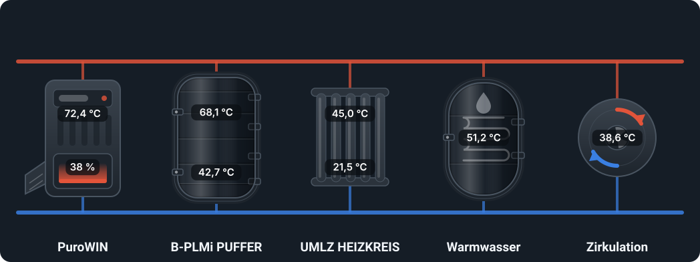
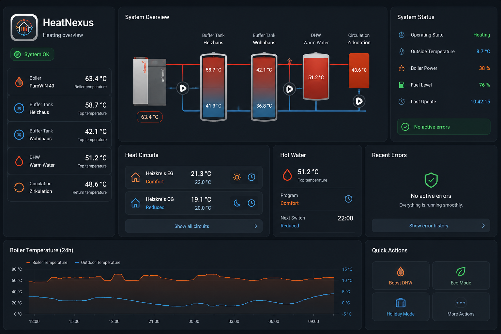

<p align="center">
  
</p>

<p align="center">
  <a href="https://github.com/xIceTea/HeatNexus/actions/workflows/validate.yml"></a>
  <a href="https://github.com/xIceTea/HeatNexus/actions/workflows/tests.yml"></a>
  
  
</p>

<p align="center">
  <a href="https://my.home-assistant.io/redirect/hacs_repository/?owner=xIceTea&amp;repository=HeatNexus&amp;category=integration"></a>
  <a href="https://my.home-assistant.io/redirect/config_flow_start/?domain=heatnexus"></a>
</p>

# HeatNexus

Heizungen in Home Assistant – lokal, vollständig, ohne Cloud.

Die Anlage wird direkt über ihre HTTP-API im Netzwerk gelesen und gesteuert.
Abgedeckt sind Kessel, Heizkreise, Puffer, Warmwasser und Zirkulation,
einschließlich Info-, Betreiber- und Serviceebene.

<p align="center">
  
</p>

<p align="center">
  <em>Das Anlagenschaubild wird aus den erkannten Anlagenteilen gezeichnet –
  wer zwei Puffer hat, sieht zwei. Beispielwerte.</em>
</p>

<p align="center">
  
</p>

<p align="center">
  <em>Das mitgelieferte Dashboard baut sich bei jedem Öffnen aus den
  vorhandenen Geräten neu auf.</em>
</p>

## Unterstützte Geräte

| Hersteller | Gerät | Stand |
|---|---|---|
| Windhager | PuroWIN (Hackgut) | getestet |
| Windhager | BioWIN, BioWIN 2 (Pellets) | eingebunden, noch nicht an Hardware geprüft |
| Windhager | UML / UMLZ Heizkreismodul | getestet |
| Windhager | B-PLMi Pufferlademodul | getestet |
| Windhager | ZSP Zirkulationssteuerung | getestet |
| Windhager | Solar, Kaskade, Wärmepumpe | werden erkannt, ungetestet |

Weitere Anlagen werden über die allgemeine Erkennung eingebunden: Was die
Steuerung liefert, erscheint auch in Home Assistant. Rückmeldungen zu nicht
gelisteten Geräten sind willkommen.

## Funktionsumfang

- **Automatische Erkennung** aller freigeschalteten Funktionen der Anlage.
  Nicht vorhandene Datenpunkte werden entfernt, schreibgeschützte nur lesend
  angelegt.
- **Wertebereiche vom Gerät**: Minimum, Maximum, Schrittweite, Einheit und
  erlaubte Auswahlwerte stammen aus den Metadaten der Anlage.
- **Thermostat je Heizkreis** mit Betriebswahl, Behaglichkeitskorrektur und
  befristetem Komfort-Sollwert.
- **Zeitprogramme** für Heizung, Warmwasser und Zirkulation lesen und schreiben.
- **Störungen im Klartext** mit Code, Art und Handlungsempfehlung.
- **Serviceebene** vollständig verfügbar, standardmäßig deaktiviert und pro
  Entity zuschaltbar.
- **Dashboard und Automations-Vorlagen** kommen mit und bauen sich aus dem,
  was die Anlage liefert.
- Mehrere Anlagen parallel.

## Installation

### Über HACS

[](https://my.home-assistant.io/redirect/hacs_repository/?owner=xIceTea&repository=HeatNexus&category=integration)

Der Knopf trägt das Repository in HACS ein und öffnet die Installation direkt.
Danach Home Assistant neu starten.

Von Hand geht es genauso: HACS → Integrationen → ⋮ → **Benutzerdefinierte
Repositories** → Repository-URL eintragen, Kategorie *Integration* →
„HeatNexus" installieren → Home Assistant neu starten.

### Ohne HACS

Ordner `custom_components/heatnexus` nach `<config>/custom_components/heatnexus`
kopieren und Home Assistant neu starten.

### Einrichtung

[](https://my.home-assistant.io/redirect/config_flow_start/?domain=heatnexus)

Oder von Hand: Einstellungen → Geräte & Dienste → Integration hinzufügen →
**HeatNexus**. Erforderlich sind die IP-Adresse der Anlage, der Zugang und das
zugehörige Passwort.

#### Zugang und Passwort

Die Schnittstelle ist dieselbe, die auch die Weboberfläche der Anlage benutzt.
Ab Werk kennt die Steuerung zwei Zugänge:

| Zugang | Passwort ab Werk | Umfang |
|---|---|---|
| `USER` | `123` | Info- und Betreiberebene |
| `Service` | `123` | zusätzlich die Fachparameter |

Ob der Zugang stimmt, lässt sich ohne Home Assistant prüfen: `http://<IP der
Anlage>` im Browser öffnen. Kommt die Weboberfläche des InfoWIN Touch, passt die
Kombination.

Wer Fachparameter auslesen oder schreiben will, wählt bei der Einrichtung
`Service`. Ein abweichender Benutzername lässt sich im selben Feld eintippen.

**Passwort ändern** lässt sich an zwei Stellen, beide führen zum selben
Parameter: direkt am InfoWIN Touch oder in dessen Weboberfläche unter
*Passwort*. Ein dort gesetztes Passwort gilt sofort auch für die Schnittstelle
– danach muss es in Home Assistant über *Neu anmelden* nachgezogen werden.

**Passwort unbekannt oder plötzlich falsch?** Ist die Anlage bei Windhager
Connect registriert, lässt sich das aktuelle Webserver-Passwort dort ablesen.
Nach der Anmeldung die Anlage auswählen – die Adresse endet dann auf
`/management`. Dieses Wort durch `settings` ersetzen:

```text
https://connect.windhager.com/systems/<Kennung der Anlage>/management
https://connect.windhager.com/systems/<Kennung der Anlage>/settings
```

Auf der Einstellungsseite steht das Passwort im Klartext und lässt sich dort
auch ändern.

> **Nach einem Software-Update:** Es kommt vor, dass der lokale Zugang nach
> einem Firmware-Update nicht mehr funktioniert, obwohl sich niemand etwas
> geändert hat. In einem beobachteten Fall stand vor dem bisherigen Passwort
> plötzlich ein **Leerzeichen** – sonst war es unverändert. Ob Absicht oder
> Versehen, ist nicht bekannt. Wer den Anmeldefehler nach einem Update sieht,
> schaut also am besten zuerst in Windhager Connect nach, was dort gerade als
> Passwort steht.

> **Windhager-App:** Wird die Anlage mit myComfort / myConnect verbunden,
> vergibt Windhager ein eigenes Passwort; die Werksangaben oben gelten dann
> nicht mehr. Das ist kein dauerhafter Ausschluss – das Passwort lässt sich wie
> oben beschrieben ablesen oder neu setzen, und danach laufen App und HeatNexus
> wieder.

> **Nur HTTP:** Die Steuerung antwortet ausschließlich unverschlüsselt auf
> Port 80; einen HTTPS-Zugang gibt es lokal nicht (geprüft am PuroWIN mit
> InfoWIN Touch). Das Passwort selbst geht dank Digest-Authentifizierung nicht
> im Klartext über die Leitung, die Messwerte schon. HeatNexus gehört deshalb
> ins eigene Netz, nicht ins Internet.

Im zweiten Schritt wird der **Umfang** festgelegt:

| Bedienebene | Inhalt | Standard |
|---|---|---|
| Info | Messwerte und Zustände | immer aktiv |
| Betreiber | Betriebswahl, Sollwerte, Programme, Warmwasser | immer aktiv |
| Service | Heizkurve, Grenzwerte, Estrichprogramm | angelegt, deaktiviert |
| Werk | Verbrennungsregelung, Zündung, Antriebe | nicht angelegt |

Dazu zwei Schalter:

- **Service-/Werksebene sofort aktivieren** – ohne Haken werden die Entitäten
  angelegt, bleiben aber deaktiviert und erzeugen keine Abfragen.
- **Service-/Werksebene bedienbar machen** – ohne Haken werden diese Parameter
  nur angezeigt. Erst mit Haken lassen sie sich schreiben.

Beides ist jederzeit über *Konfigurieren* an der Integration änderbar, ebenso
das Abfrageintervall. Nach einer Änderung liest die Integration die Anlage neu
ein.

#### Die erste Minute

Nach dem Einrichten steht die Integration sofort da, aber noch **nicht
vollständig**: Zuerst entsteht der Grundstock an Entitäten, dann liest
HeatNexus die Anlage im Hintergrund komplett ein. Je nach Anlage dauert das
30 bis 120 Sekunden, und in dieser Zeit kommen laufend weitere Entitäten
dazu – aus einer Handvoll werden je nach Umfang schnell mehrere hundert.

Eine Benachrichtigung begleitet den Vorgang und nennt am Ende die gefundene
Anzahl. Es ist also kein Grund zur Sorge, wenn direkt nach dem Einrichten erst
wenige Werte zu sehen sind.

Das Ergebnis wird gespeichert und übersteht Neustarts; beim nächsten Start ist
alles sofort da. Neu eingelesen wird nur nach einer Änderung des Umfangs, nach
einer neuen Version oder über den Dienst `heatnexus.rediscover`.

## Dienste

| Dienst | Wirkung |
|---|---|
| `heatnexus.set_time_program` | Zeitprogramm setzen (`switch_points` mit `weekdays`, oder `blocks` für getrennte Wochenpläne) |
| `heatnexus.set_current_temp_compensation` | Behaglichkeitskorrektur eines Heizkreises |
| `heatnexus.rediscover` | Anlage neu einlesen, z. B. nach Umbauten |

```yaml
service: heatnexus.set_time_program
target:
  entity_id: sensor.heizkreis_programm_1
data:
  weekdays: ["Mo", "Di", "Mi", "Do", "Fr"]
  switch_points:
    - {time: "06:00", value: 21}
    - {time: "22:00", value: 18}
```

## Dashboard

Ein Dashboard **Heizung** erscheint nach der Einrichtung von selbst in der
Seitenleiste. Es wird aus den tatsächlich gefundenen Geräten gebaut – keine
Entitäts-IDs eintragen, kein YAML kopieren:

- **Übersicht** – je Anlagenteil die wichtigsten Werte, in fachlicher
  Reihenfolge (Kessel, Puffer, Heizkreis, Warmwasser, Zirkulation), dazu die
  Störungsmeldungen. Bei mehreren Anlagen steht die Anlage in der Überschrift,
  damit zwei gleich benannte Anlagenteile unterscheidbar bleiben.
- **Anlage** – ein Schaubild je Anlage: Kessel, Puffer, Heizkreise, Warmwasser
  und Zirkulation, verbunden durch Vor- und Rücklauf, mit den Live-Werten
  darauf. Gezeichnet wird, was gefunden wurde – bei zwei Puffern erscheinen
  zwei.
- **Wartung** – Restlaufzeiten bis Ascheentleerung, Hauptreinigung und Wartung
  als Rundinstrument, dazu Brennstoff, Vorratsbehälter und Zählerstände.
- **Auswertung** – Zuwachs der Zähler *heute* und *diesen Monat*
  (Brennerstarts, Betriebsstunden) sowie Temperaturverläufe der letzten
  48 Stunden je Anlagenteil.
- **Je Anlagenteil eine Ansicht**, gegliedert in Bedienung, Messwerte,
  Einstellungen und Diagnose.

Fehlt ein Anlagenteil, entfällt der Block. Wird der Umfang später geändert,
passt sich das Dashboard beim nächsten Öffnen an. Abschalten lässt es sich
unter *Konfigurieren → Allgemein*.

Wer lieber selbst baut: Vorlagen für Gesamtübersicht, Bedienkarten und ein
Anlagenschaubild liegen unter [`dashboards/`](dashboards/).

## Automations-Vorlagen

Fünf Blueprints werden mitgeliefert und liegen nach der Einrichtung unter
*Einstellungen → Automationen & Szenen → Blueprints* bereit – ohne Import aus
dem Netz:

| Vorlage | Zweck |
|---|---|
| Störung melden | Meldung bei Störung, Erinnerung in festem Abstand, Entwarnung |
| Wartungswarnung mit Erinnerung | Vorwarnung, Warnung und Erinnerung für eine Restlaufzeit (Asche, Reinigung, Wartung) |
| Brennstoffvorrat niedrig | Meldung, wenn der Vorratsbehälter leer meldet, mit Erinnerung |
| Betriebsdauer erfassen | Misst, wie lange ein Anlagenteil ununterbrochen läuft |
| Heizkreis bei Abwesenheit absenken | Absenken bei Abwesenheit, Rückstellen bei Rückkehr |

Was bei einem Ereignis passieren soll, gibt die jeweilige Automation vor –
Benachrichtigung, Ansage, Anruf, beliebige Aktion. Die Störungsvorlage wertet
das Attribut `stoerung_aktiv` aus, nicht den angezeigten Text; sie hängt damit
an keiner Formulierung.

## Dokumentation

| Datei | Inhalt |
|---|---|
| [`docs/API.md`](docs/API.md) | Geräte-API und OID-Aufbau |
| [`docs/ARCHITECTURE.md`](docs/ARCHITECTURE.md) | Aufbau der Integration |
| [`docs/DATAPOINTS.md`](docs/DATAPOINTS.md) | Datenpunkte je Funktionstyp |
| [`CHANGELOG.md`](CHANGELOG.md) | Versionshistorie |

## Entwicklung

```bash
pip install -r requirements_test.txt
pytest
ruff check custom_components tests tools
```

Anlage auslesen – unter Windows genügt ein Doppelklick auf `tools/probe.cmd`,
sonst:

```bash
python tools/heatnexus_probe.py                       # geführter Modus
python tools/heatnexus_probe.py all 192.0.2.10 192.0.2.11
```

Details in [`tools/README.md`](tools/README.md).

## Hinweis

Die Integration schreibt auf eine Heizungsanlage. Steuerbare Datenpunkte der
Betreiberebene sind geprüft, Serviceparameter sind bewusst deaktiviert.
Nutzung auf eigene Verantwortung.
